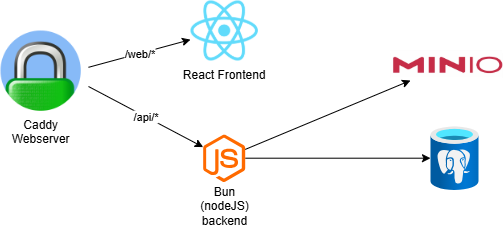

## System architecture

The below diagram describes the current architecture of the system

The system consists of 4 components:

#### Webserver

The webserver chosen in this application is Caddy, due to it's ease of use and capability of automatic SSL certificate negotiation. The web server serves the react frontend and proxies the requests from /api/* to the backend. The proxying is required as the session management chosen in this architecture is using cookie-based session authentication, which must be done with the same domain / subdomain.

#### React Frontend

The react frontend serves as the display layer for the application, which allows for user interaction. It is stateless and gathers session information from querying the endpoint at /api/session, which sets the session state in the fronend

#### ElysiaJS backend

ElysiaJS serves as the backend for API calls for session management, user managment, as well as proxying calls from the frontend to upload files to MinIO (S3), as well as requesting for pre-signed links that the user can use to download files from MinIO. 

#### MinIO storage

MinIO serves as a S3 replacement in this application. the MinIO instance stores the Audio files in this application

#### PostgreSQL Database

PostgreSQL is the database for this solution which stores the user authentication data such as usernames, hashed+salted passwords and role information. It also stores the Audio metadata in this solution
